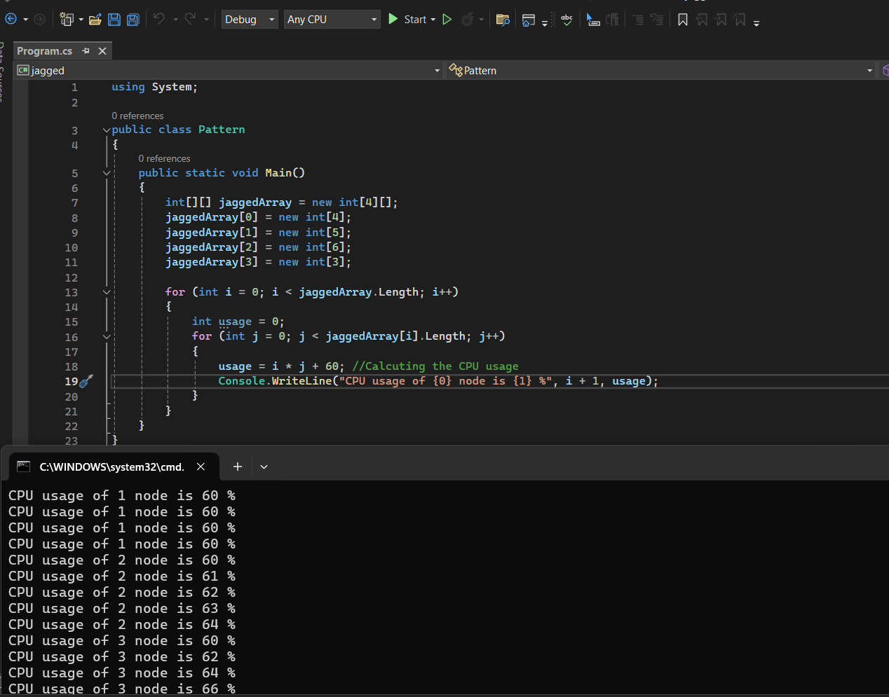

# Exp04-Jagged-Array
## Aim:

To write a C# program to create a sample CPU usage on a network with 4 nodes using a jagged array.


## Algorithm:

Step1:
Create a new Class named cpu.

Step 2:
Create a jagged array of 4 arrays. int[][] array = new int[][];

Step 3:
Create as many sub-nodes as you wish inside one node of jagged array.

Step 4:
Give the sample CPU usage in the jagged array.

Step 5:
Print the sample CPU usage in the jagged array.

Step 6:
End the Program.

## Program:
Name : VINUSH.CV

Reg no : 212222230176

```c#
using System;

public class Pattern
{
    public static void Main()
    {
        int[][] jaggedArray = new int[4][];
        jaggedArray[0] = new int[4];
        jaggedArray[1] = new int[5];
        jaggedArray[2] = new int[6];
        jaggedArray[3] = new int[3];

        for (int i = 0; i < jaggedArray.Length; i++)
        {
            int usage = 0;
            for (int j = 0; j < jaggedArray[i].Length; j++)
            {
                usage = i * j + 60; //Calcuting the CPU usage
                Console.WriteLine("CPU usage of {0} node is {1} %", i + 1, usage);
            }
        }
    }
}

```
## Output:




## Result
Thus,To write a C# program to create a sample CPU usage on a network with 4 nodes using a jagged array executed successfully.

